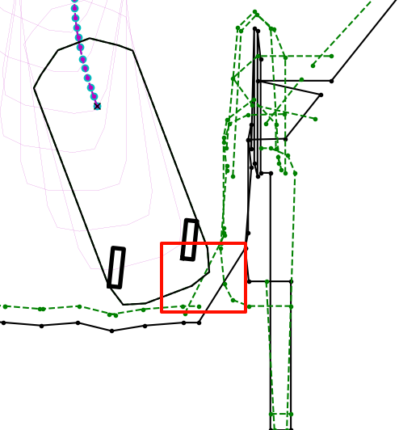
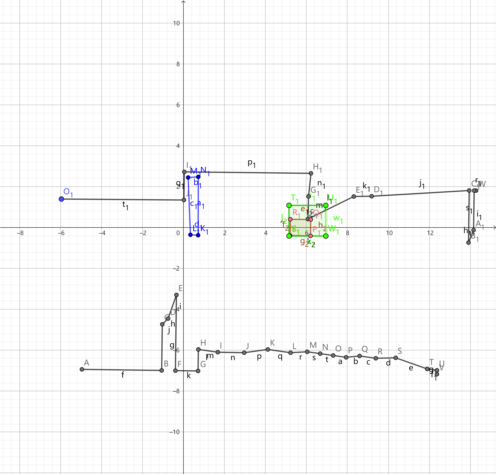

## 分支说明

1、dev_LocTrajPlannGen2.0：该分支集成了所有最新更新的内容（包含水平泊入与完全泊出等），新车型非近期量产的项目用该分支
2、dev_b07_m82：该分支创建初衷是为了用于B07与M82项目（不包含水平泊入与完全泊出等功能代码），目前针对一些近期就需要量产的项目也用该分支，当前版本号：4.9.10
3、dev_b07_test：该分支用于b07测试版本的发布，目前与dev_b07_m82分支的区别只在于针对某些区域特殊调整了安全距离，目前已发布出去的测试版本号为：4.9.202
4、feature_for_demo：该分支用于demo项目的Planning软件版本发布，当前用于CX756Demo项目，已发布的测试版本号：4.9.103
5、feature_planning_optimize：该分支用于新功能代码的开发，待验证完成再导入其他分支中使用。

## 基础

1. Seq_num 关键字查找: `Start Runonce [XXX]` (每帧开始的Flag)
2. MAP 发送消息 关键字 `==app===APAMap==Someip_ParkReqPar`
	1. 发送的为引导传来的 `APARunningstate` `reqcnt` ... 等
	2. `failcause(XX)`  Map 模块报错消息
		1. 60 :  状态异常 相当于重置了 如果 result 为1 则不用看这个
		2. 52 :  车位过小
3. CanOe 733 DecTarCarPosSource 如果值为1  则表示来源为1

Planning BackPlay时要注意车型，车型与Log不同时要修改配置文件 
`conf/general_config.pb.txt `中修改 `vehicle_config_file: "proj_gwm_p01_2.xml"`


`Last traj collision with current environment`
最后一步轨迹会与更新后的环境发生碰撞

如果规划时边界发生改变，规划的第一步轨迹与碰撞安全距离后的边界发生碰撞时认为ok，后续其他节点按照新边界避免碰撞


## 车型
<mark style="background: #FF5582A6;">!!! 看数据时要 注意车型切换</mark>

二次起步可能原因 为发生重规划时，车子由于惯性还按上次规划路径行驶一段，在重规划结果出来时，档位可能发生变化，但由于在计算时间内车子还行驶了一段导致 到重规划后的关键点距离较近，认为此次重规划无效；重新进行重规划；产生二次起步

## 重规划
`Ori Input force_direction_plan: ` 若为true 则为引导请求强制重规划
`Input force_direction_forward:` 重规划且向前
`Parking_request ori requre_replan` 决策请求重规划


## 重规划与边界·

发生重规划后 若轨迹第一步车身可能与安全边界相交是ok的 后续的轨迹会让车子避开
若重规划前车身与安全边界较近或者相交是无法规划的


## 编译planning软件
要利用aarch 编译器进行编译 （下位机）


## 断头路类型：
`DeadendScenario==Type(x)`
x: 1： 半断头路 
   2：普通车位 没识别 
   3及以上为断头路 具体类型高专家看

如果断头路 识别为地上场景 对向距离会限定为 7m

B06 WI-849



## 松弛endpos搜索

log 如下：

```latex
[08-21 15:29:29] explored_node_num_: 2088
[08-21 15:29:29] A_Star explored node num is 2088
```

如果两个同时有，则explored_node_num： 为固定解搜索的节点  A_star为搜索松弛endpos的节点（搜索800ms结束 实车一般搜不了这么久）

回注时会搜索到800ms，会出现 A_star explored node num 很多


