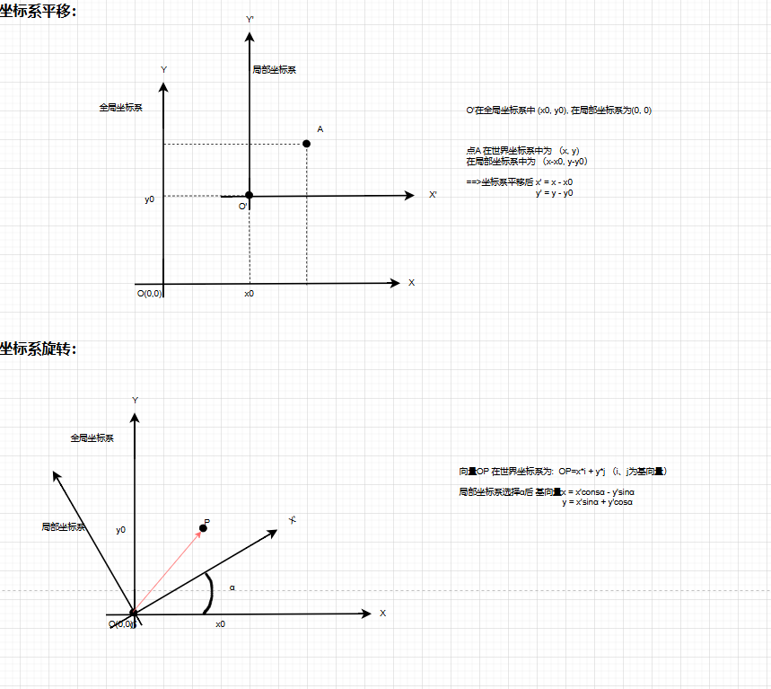
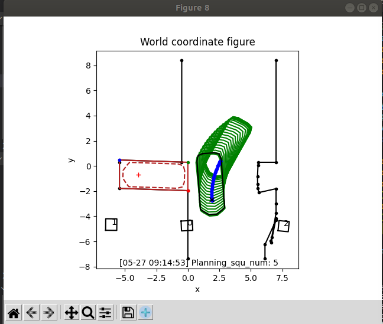
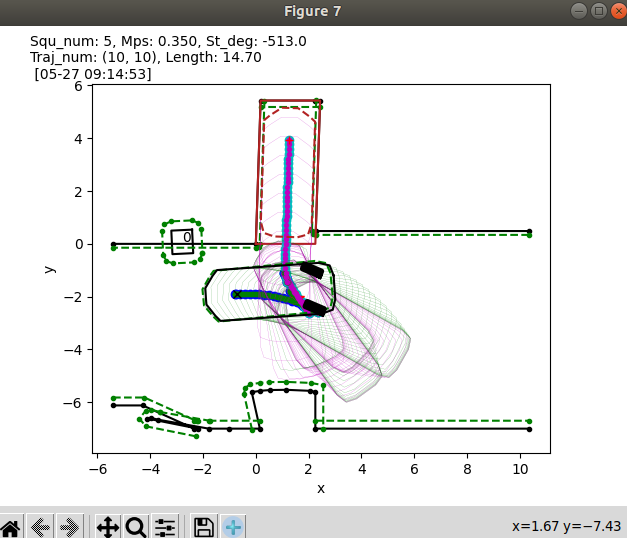
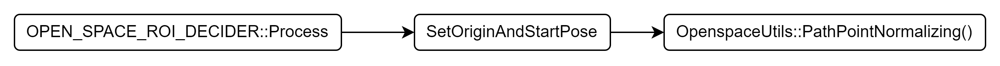
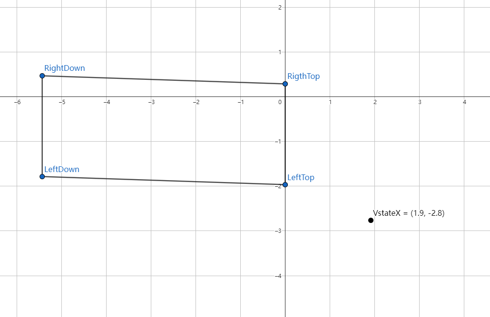
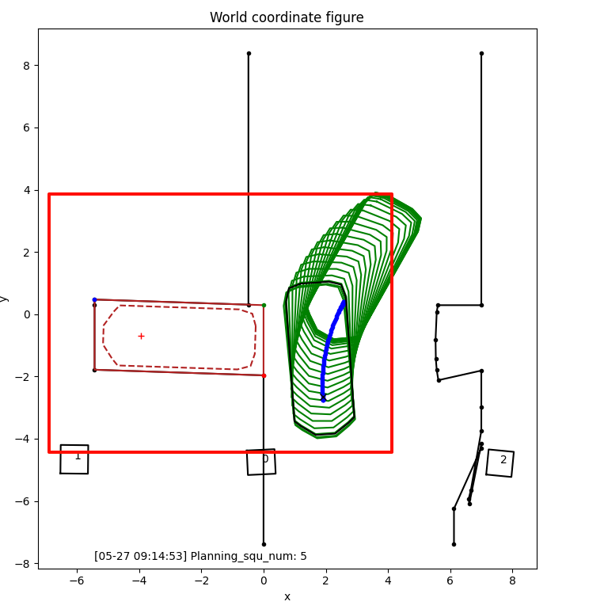
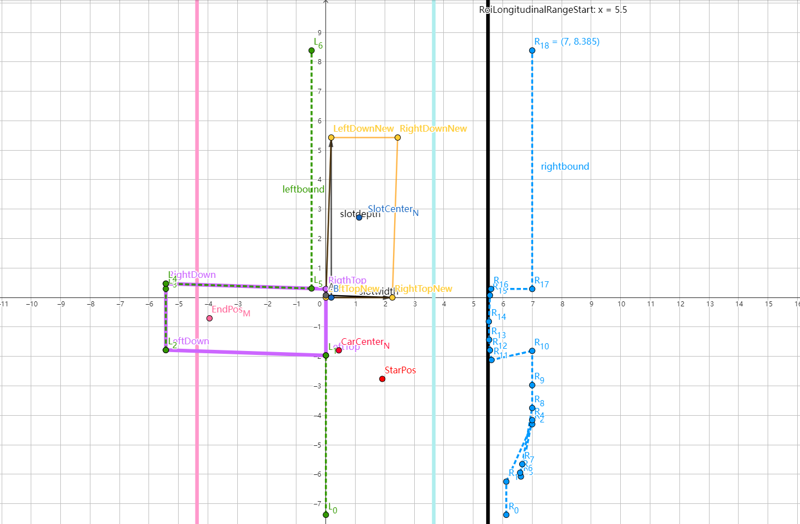
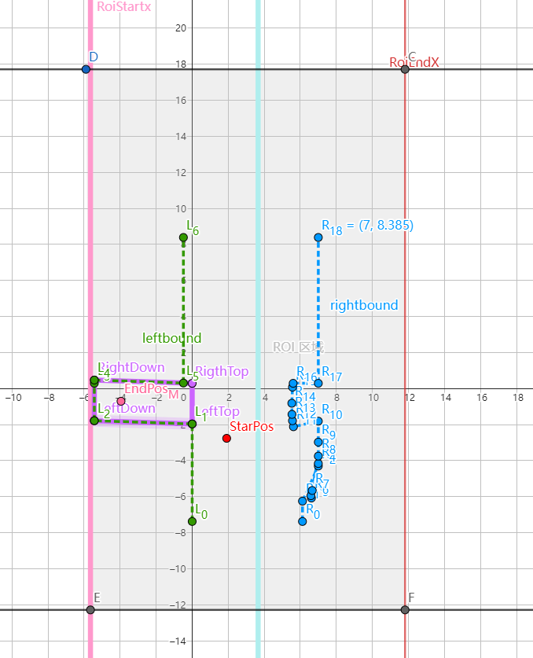
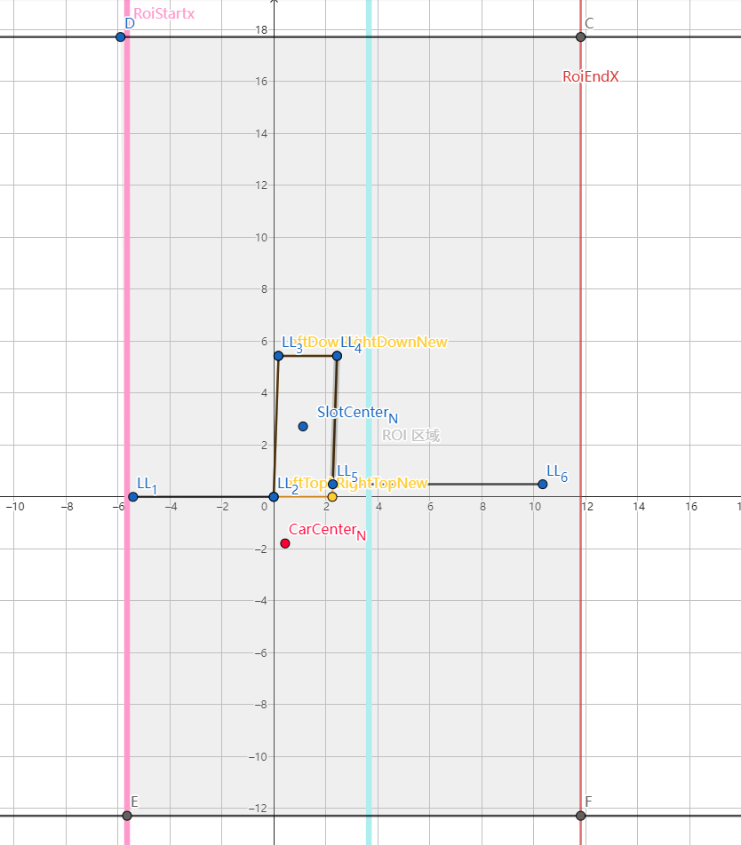

##　bool OpenSpaceRoiDecider::GetParkingSpot

获取车位四个顶点


## bool OpenSpaceRoiDecider::SetParkingSpotEndPose


为 Open Space 规划器生成一个“驶离停车位后短暂跟线行驶”的局部目标位姿（含位置、朝向、速度），作为非结构化轨迹优化的终点约束

Vec2d::SelfRotate 坐标系旋转函数



## bool OpenSpaceRoiDecider::SetParkingSpotEndPose

设置 endpos 位置

### 坐标系

frame->planning_start_point_为世界坐标系下的起点位置
open_space_info.open_space_end_pose()　为车身坐标系

M 坐标系：（世界坐标系）



N 坐标系：（车身坐标系）


```
OpenspaceUtils::PathPointNormalizing(xxxxx)` 函数 对坐标系进行转换 M -> N

OpenspaceUtils:: `PathPointDeNormalizing`() 对坐标系进行转换 N-> M
```



`OpenSpaceRoiDecider::GetParkingBoundary()`:
RightTop、RightDown、LeftDown、LeftTop 如下：（世界坐标系下） 对应如下




OriginPoint 为 LeftTop

如下图，紫色为 M 坐标系下的车位，橙线为 N 坐标系下的车位



传入数据：
世界坐标系下：


ROI、Boundary 如上

### ProcessOneSideBoundaryPoints 函数

实现由lambda表达式实现（lambda 实现一个匿名函数）

​	基本语法：

```
[capture](parameters) mutable(opt) noexcept(opt) -> return_type(opt) { body } 
```


### 将 Boundary 转为车身坐标系（N 坐标系）：

后如下图：

