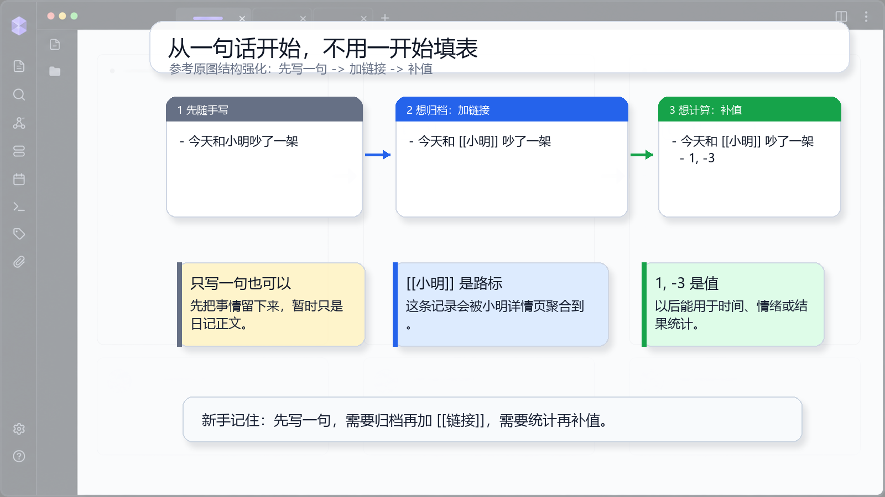

# 00 先把心理压力降下来

## 一句话理念

你不用一开始就填表。先把事情写成一句人话，系统会在后面通过链接、标签、数值和关键字慢慢理解它。

## 文档图面



## 这张图怎么看

图里把同一件事拆成三步：先写一句普通话，再把“小明”改成 `[[小明]]`，最后在下一层补 `1, -3`。新手可以直接照着图理解每一步多了什么能力。

这张图想表达的是：不是一开始就填表，而是按需要逐步补结构。

## 怎么写

先写最轻的一句：

```md
- 今天和小明吵了一架
```

需要进入人物页时，再把对象写成链接：

```md
- 今天和 [[小明]] 吵了一架
```

需要参与计算时，再补值：

```md
- 今天和 [[小明]] 吵了一架
  - 1, -3
```

## 为什么这样写

普通文字只是一段日记正文。`[[小明]]` 让系统知道这条记录和“小明”有关。下一层的 `1, -3` 让系统知道它还带有可计算的量，比如时间、投入或情绪。

系统真正需要的不是一整张表，而是几个小部件：描述、链接、值、标签和关键字。缺哪个，就只是少了一部分能力，不代表记录失败。

## 写作减压点

先写一句人话就够了。链接可以以后补，值可以以后补，关键字更可以等你真的需要统计时再补。
