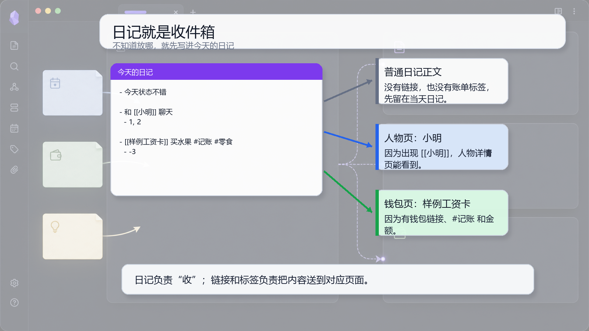

# 01 从日记开始

## 一句话理念

日记是当天记录的收件箱，不是最终分类柜。不知道放哪里，就先写进今天的日记。

## 文档图面



## 这张图怎么看

图里左边是今天的日记，里面同时放了普通记录、人物事件和账单。右边展示系统会怎么理解：普通记录留在日记，`[[小明]]` 流向人物页，`[[样例工资卡]] + #记账 + 金额` 流向钱包页。

## 怎么写

先写一条普通日记：

```md
- 今天状态不错
```

写一条和人有关的事：

```md
- 和 [[小明]] 聊天
  - 1, 2
```

写一条账单：

```md
- [[样例工资卡]] 买水果 #记账 #零食
  - -3
```

## 为什么这样写

日记负责“收”。链接负责“送”。`[[小明]]` 会让人物页看到这条事情，`[[样例工资卡]]` 和 `#记账` 会让钱包页看到这条流水。

你不需要把同一件事复制到很多页面。写在日记里，后面的详情页会按链接和标签聚合。

## 写作减压点

先不要问“这条记录到底属于哪个页面”。只要它发生在今天，就先放进今天的日记。

## 真实界面对照

原教程里的新建日记截图可以继续用来对照操作入口：

![[Pasted image 20260508212658.png]]

![[Pasted image 20260508212720.png]]

![[Pasted image 20260508212808.png]]
