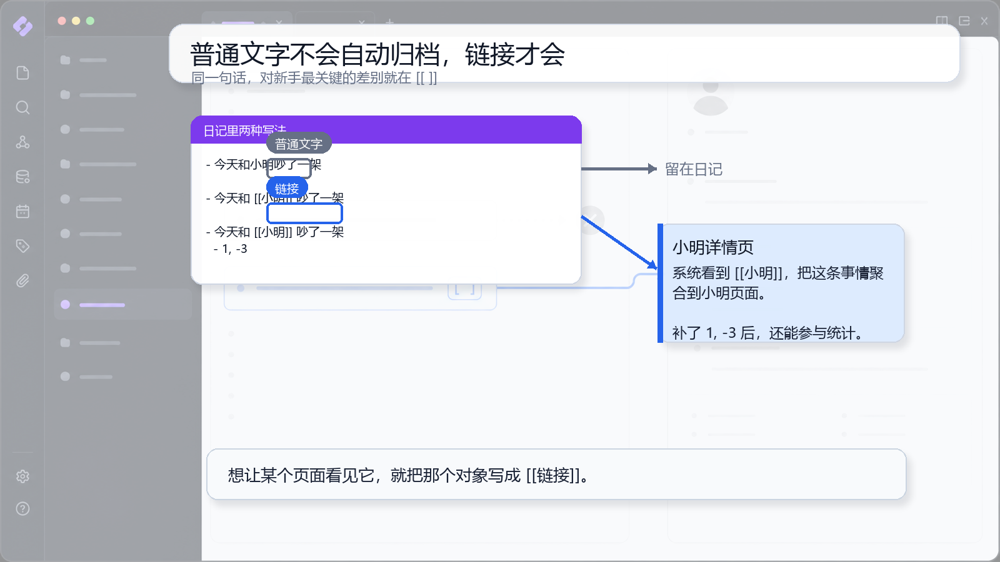

# 02 写事情：让链接帮你归档

## 一句话理念

链接不是装饰，而是归档方向。普通文字留在日记里，`[[链接]]` 会把记录指向对应详情页。

## 文档图面



## 这张图怎么看

图里直接对比了“小明”和 `[[小明]]`。普通文字只是正文，留在日记；链接会让这条记录进入小明详情页。

这不是复制粘贴，而是系统按 `[[链接]]` 做聚合。

## 怎么写

只是记录事实：

```md
- 今天和小明吵了一架
```

让小明详情页看到：

```md
- 今天和 [[小明]] 吵了一架
```

需要补时间或情绪时：

```md
- 今天和 [[小明]] 吵了一架
  - 1, -3
```

## 为什么这样写

系统不会猜测普通文字“小明”一定是人物页。写成 `[[小明]]` 后，它才是明确的对象链接。

如果不写值，这条事情仍然可以被聚合；只是暂时没有时间、情绪等可计算信息。链接解决“归到谁”，值解决“怎么算”。

## 写作减压点

先只补最关键的链接。值、情绪、日期都可以以后再补，不影响这条事情先进入详情页。

## 真实界面对照

原截图可以作为详情页聚合效果的对照：

![[Pasted image 20260508213442.png]]
