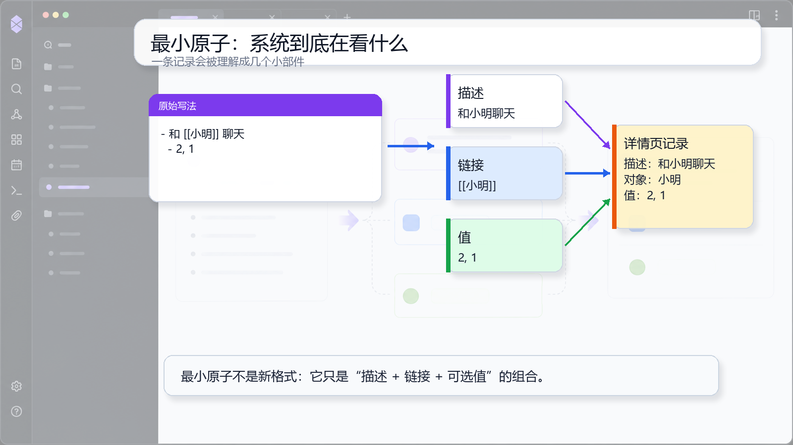

# 03 最小原子：系统到底在看什么

## 一句话理念

无论你写得松还是严，系统最后都在找一条能独立展示的小记录，也就是“最小原子”。

## 文档图面



## 这张图怎么看

左边是一条真实 Markdown 例子。中间把它拆成描述、链接和值。右边展示详情页最终看到的一条记录。

这张图想让你看到：格式不是为了格式本身，而是为了让系统拿到能展示、能聚合、能计算的小部件。

## 怎么写

一条普通事情原子：

```md
- 和 [[小明]] 聊天
  - 2, 1
```

一条账单原子：

```md
- [[样例信用卡]] 买会员 #记账
  - -30
```

一条暂时只有链接的原子：

```md
- 读了 [[系统维护手册]]
```

## 为什么这样写

一条能独立展示的记录，通常有这些部分：

| 部件 | 用途 |
|---|---|
| 描述 | 显示这件事是什么 |
| 链接 | 指向人物、项目、钱包或任意对象 |
| 值 | 提供时间、情绪、金额等可计算量 |
| 标签 | 告诉系统这是不是账单、分类是什么 |

不是每条记录都必须一次写齐。普通事情可以没有值，账单则必须有金额。

## 写作减压点

你不用背全部格式。先问这条记录是否能回答两个问题：它是什么？它和谁或哪个对象有关？能回答，就已经接近一个原子。
