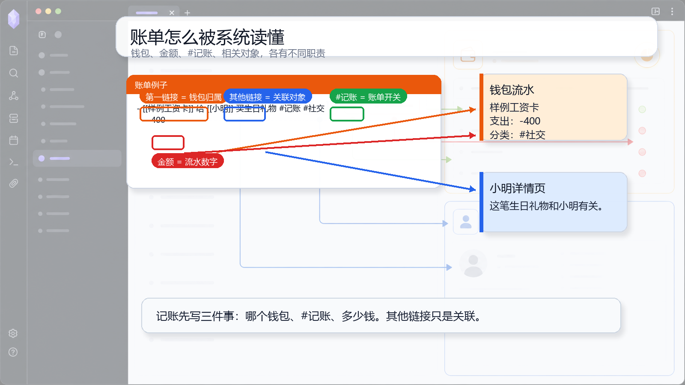

# 04 写账单：钱包链接、金额和标签

## 一句话理念

账单不是普通事件。钱包链接决定归属，金额决定流水，`#记账` 决定它进入账务口径。

## 文档图面



## 这张图怎么看

图里直接标出了账单里的四类信息：第一个链接是钱包归属，其他链接是关联对象，`#记账` 是账单开关，下一层金额是流水数字。

图里有两条路：一条去钱包流水，一条去相关对象。不要把这两条路混在一起。

## 怎么写

最稳写法：

```md
- [[样例工资卡]] 买水果 #记账 #零食
  - -3
```

关联人物或项目：

```md
- [[样例工资卡]] 给 [[小明]] 买生日礼物 #记账 #社交
  - -400
```

补账单关键字：

```md
- [[样例信用卡]] 买一年会员 #记账
  - -120
  - BILL:2026-05-20; LIFE:365; SOURCE:[[会员订单截图]]
```

## 为什么这样写

钱包页需要知道“这笔钱归哪个钱包”。所以建议把钱包链接放在第一位。`#记账` 告诉系统这条记录要按账务规则解析。金额放在第一个子项，系统才能形成收入或支出。

其他链接不是归属钱包，而是关联对象。比如 `[[小明]]` 会让小明详情页知道这笔往来和他有关。

## 写作减压点

新手先只写三件事：钱包、`#记账`、金额。分类、入账日、来源截图都可以后补。

## 真实界面对照

原教程截图可以用来对照钱包流水和相关对象聚合：

![[Pasted image 20260508225025.png]]

![[Pasted image 20260508225440.png]]

![[Pasted image 20260508225447.png]]
