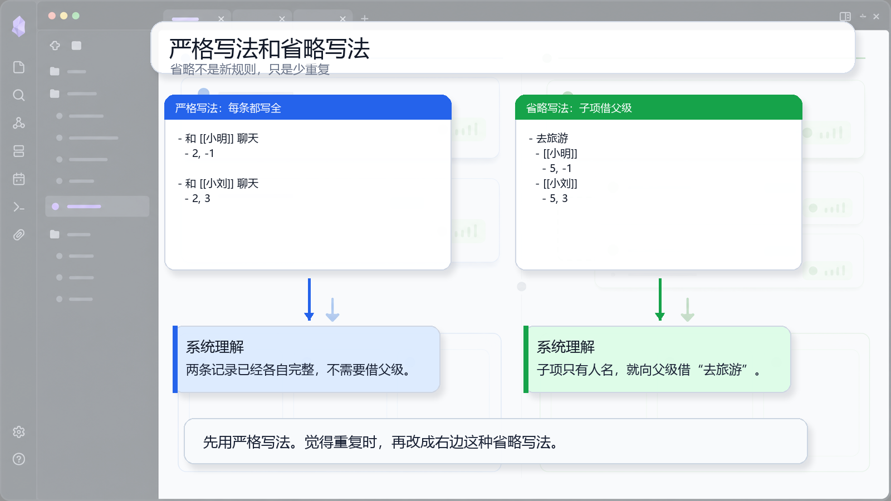

# 05 写法心法：严格写法和省略

## 一句话理念

严格写法最稳，省略写法只是少重复。先严格写，熟了再让子项向父级借背景。

## 文档图面



## 这张图怎么看

图里左边是严格写法，每条都写全。右边是省略写法，子项只有人名时，会向父级借“去旅游”这个背景。

这张图的重点是：省略不是新规则，只是减少重复。

## 怎么写

严格写法：

```md
- 和 [[小明]] 聊天
  - 2, -1

- 和 [[小刘]] 聊天
  - 2, 3
```

省略写法：

```md
- 去旅游
  - [[小明]]
    - 5, -1
  - [[小刘]]
    - 5, 3
```

已经完整的子项：

```md
- 去旅游
  - 和 [[小明]] 聊天
    - 2, 1
```

## 为什么这样写

严格写法里，每条记录都能自己成立。省略写法里，子项如果只有 `[[小明]]` 这种对象，就会向父级借“去旅游”作为描述。

但子项如果已经是“和 [[小明]] 聊天”，它自己就是一个原子，父级只当分组背景，不再拼进去。

## 写作减压点

看不懂解析时，先回到严格写法。严格写法不是低级写法，而是最稳的基准写法。
