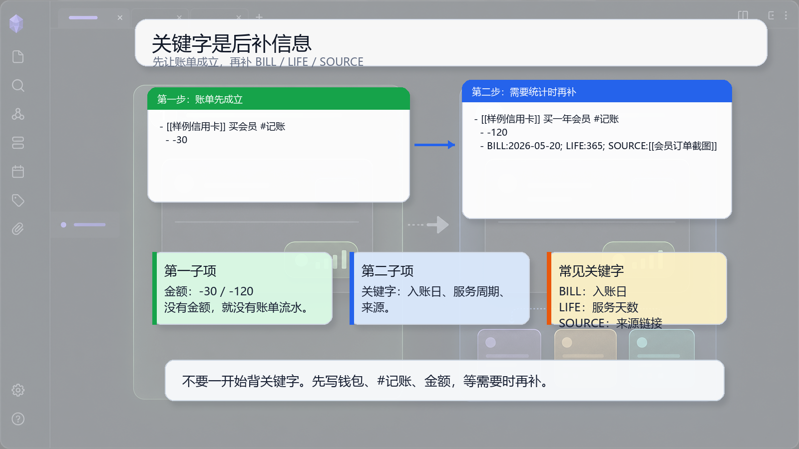

# 06 关键字：等原子成立后再补充

## 一句话理念

关键字不是正文骨架，而是原子成立后的补充贴纸。先写记录，再补计算信息。

## 文档图面



## 这张图怎么看

图里把账单分成两步：第一步先让账单成立，第二步在需要统计时再补 `BILL:`、`LIFE:`、`SOURCE:`。

这张图想表达的是：关键字是后补计算信息，不是新手第一眼就必须背下来的骨架。

## 怎么写

先写成立的账单：

```md
- [[样例信用卡]] 买会员 #记账
  - -30
```

再补一个关键字：

```md
- [[样例信用卡]] 买会员 #记账
  - -30
  - BILL:2026-05-20
```

多个关键字写在同一行：

```md
- [[样例信用卡]] 买一年会员 #记账
  - -120
  - BILL:2026-05-20; LIFE:365; SOURCE:[[会员订单截图]]
```

## 为什么这样写

账单的第一层是金额。没有金额，就没有流水。`BILL:`、`LIFE:`、`SOURCE:` 是第二层，它们用来补入账日、服务周期和来源证据。

普通事情的日期也一样，可以先写事情，再补 `@2026-05-08` 这类日期关键字。

## 写作减压点

不要一上来背关键字。你可以先写钱包、`#记账` 和金额。等真的要做生活成本、入账日或来源追溯时，再补关键字。
