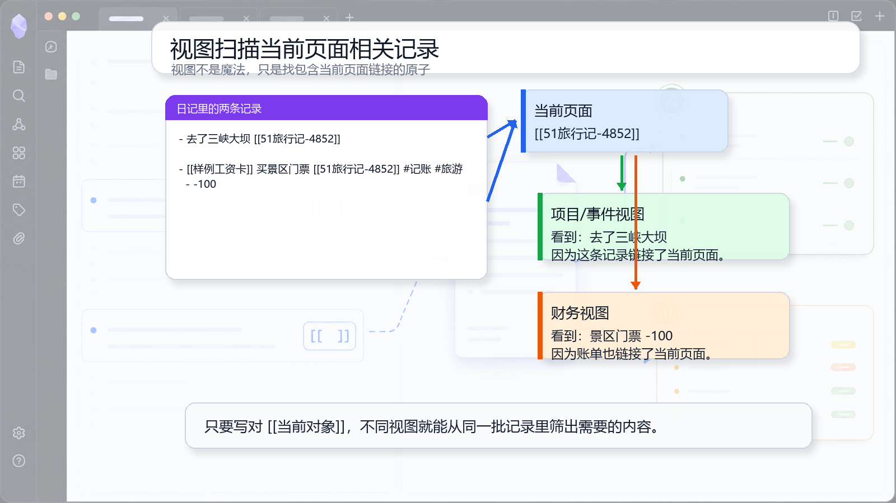

# 07 泛化：所有视图都在看相关原子

## 一句话理念

视图不是认固定页面类型，而是看当前页面是谁，再扫描和它有关的原子。

## 文档图面



## 这张图怎么看

图里左边是两条日记记录，它们都包含 `[[51旅行记-4852]]`。右边展示当前页面和两个视图输出：事件视图看到旅行事件，财务视图看到账单金额。

这张图想消除“视图是魔法”的感觉。它只是按当前页面链接筛相关记录，再按视图类型展示。

## 怎么写

让事件页被日记记录引用：

```md
- 去了三峡大坝 [[51旅行记-4852]]
```

让账单也关联同一个页面：

```md
- [[样例工资卡]] 买景区门票 [[51旅行记-4852]] #记账 #旅游
  - -100
```

在对象页里插入视图片段：

```md
![[项目详情]]
```

## 为什么这样写

当当前页面是 `[[51旅行记-4852]]` 时，视图会找所有包含这个链接的原子。普通事件、账单、项目进展都可以被找到，只是不同视图展示的重点不同。

所以这套写法可以泛化：人物、项目、钱包甚至一篇旅行记录，都可以成为“当前对象”。

## 写作减压点

你不用提前决定这条记录将来进哪个视图。只要记录里有正确链接，后面的视图就有机会扫描到它。

## 真实界面对照

原教程里的对象页截图可以作为真实界面对照：

![[Pasted image 20260509122440.png]]
